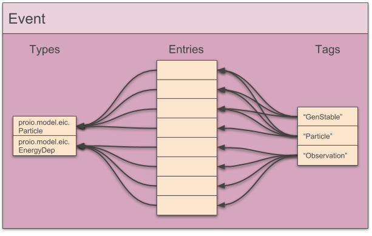
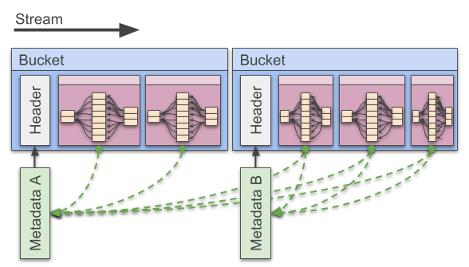

# Status 
* [Go](go-proio)
  * Mostly complete
  * Still needs to write file descriptor protos to bucket headers
  * Needs comprehensive recovery tests
  * Need to add back in examples.
* [Python](py-proio)
  * Mostly complete
  * Still needs to write file descriptor protos to bucket headers
  * Needs comprehensive recovery tests
  * Need to add back in examples
* [C++](cpp-proio)
  * Code has been cleared out with recent rewrite of Go and Python libraries
  * Needs to be rewritten based on new scheme developed in Go and Python
  * High priority
* [Java](java-proio)
  * Code has been cleared with recent rewrite of Go and Python libraries
  * Needs to be rewritten based on new scheme developed in Go and Python
  * Lower priority
  
# What is proio?
Proio is a library and set of tools that provide a simple but powerful and
performant IO for physics events.  Proio uses Google's protocol buffer
libraries and aims simply to add the concept of an event to a protocol buffer
IO.  This work was inspired and influenced by
[LCIO](https://github.com/iLCSoft/LCIO), ProMC (Sergei Chekanov), and EicMC
(Alexander Kiselev).  Another primary goal of proio is to be language-neutral,
in the sense that users can be free to use Go, Python, C++, or Java without any
significant drawback to any particular choice (proio is under active
developement, please see above for status).  Each language implementation is
written natively, and protobuf compilers generate code in each language from a
single source.  The protobuf messages described in the generated code are used
by the proio libraries to produce serialized event structures for IO.

# Events
The proio event structures can contain any protobuf messages that the user
wishes to write to the stream or file.  Each event contains a list of entries
which are the user data structures (required to be protobuf message
implementations).  This list of entries is organized with the use of tags.  A
tag is a mapping from a human-readable string to an event entry.  Each event
carries a list of tags that point to locations in the list of entries.  The
concept of tags replaces the concept of collections in LCIO.  The difference
between collections and tags is that a given tag can point to any type of data
structure, and any number of tags may point to the same entry.

Events also carry a list of protobuf message types entered into the event by
the user.  These are string identifiers used by the protobuf libraries and
specified by the writers of the protobuf files.  Proio is distributed with
common messages that are organized into data models.  For example,
`proio.model.lcio.MCParticle` is one available type that is distributed with
proio.  Users can create and use their own types, but most users do not need to
do this, or even worry about protobuf messages at all.  The libraries
automatically determine the types of the entries and store them.  When reading
a file, the proio libraries use these type identifiers to look up message
descriptors in memory, and create objects of the appropriate type in memory to
then fill with the stored data.

# Buckets
Proio writes events into what are called buckets.  A bucket is a collection of
sequential events that are compressed together, and has a header describing the
contents of the bucket (e.g. compression type and number of events contained).
The proio library adds events to a bucket until the bucket starts to overflow
based on a specified target bucket size in bytes, at which point the bucket is
written out to the stream or file.  The proio reader can use the lightweight
bucket headers to efficiently scan the contents of a file.  The bucket headers
are implemented as protobuf messages, so additional metadata can be added to
the headers without breaking compatibility.  Additionally, bucket headers can
store protobuf file descriptor protos.  These can be added to the stream by the
writer so that the reader has all of the information needed to read the user's
event data, even without having access to the particular protobuf message code
used by the user.

# Getting started
The best way to get started with proio is to look at examples.  First, pick a
language of your choice, and navigate to that subdirectory in this repository.
Follow the installation instructions given in the corresponding README.md, and
then follow some examples that are described there as well.
